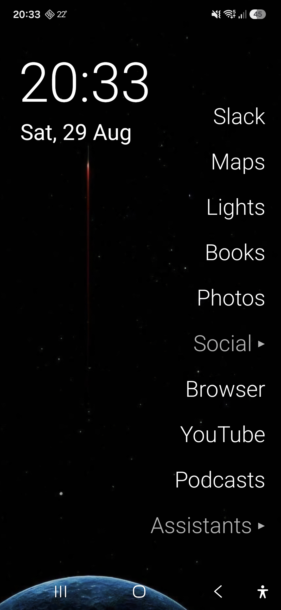

# OlauncherRedux

A minimal, text-only Android launcher. No icons, no widgets, no internet permission.

OlauncherRedux is a fork of [OlauncherCF](https://github.com/OlauncherCF/OlauncherCF), which was a fork of [Olauncher](https://github.com/tanujnotes/Olauncher). OlauncherCF is archived, so this fork continues it with new features.



## Install

1. Download the latest `OlauncherRedux-vX.Y.Z.apk` from the [Releases](https://github.com/dmahlow/OlauncherRedux/releases) page.
2. Open the file on your phone. Android will ask you to allow installs from this source.
3. Press the home button and pick OlauncherRedux as your default launcher.

OlauncherRedux uses its own package name (`app.olauncherredux`), so it can be installed next to Olauncher or OlauncherCF. Settings are not shared between them. You can move your settings over with Backup in the settings.

## What is new in OlauncherRedux

Everything OlauncherCF had, plus:

- **App groups on the home screen.** Long press a home screen slot and choose "Set Group". A group shows as `Name ▸`. Tap it to open the group and see its apps; tap outside to close. Groups hold up to 15 apps.
- **Sort the app drawer by most used.** Apps you open often move to the top. Use in the last 7 days counts more than older use. Apps that are already on the home screen or on a gesture move to the bottom, because they are quick to reach anyway. This is the default. It needs the "Usage access" permission; the drawer shows a hint until you allow it. Without it, the drawer sorts A-Z.
- **Sort the app drawer by time of day.** A third sort option. Apps you usually open around this time of day move to the top, for example an authenticator in the morning and a video app at night. Weekends and weekdays are learned separately. It counts app launches from about the last one to two weeks, so short-use apps rank fairly. Also needs "Usage access".
- **Optional app icons in the drawer.** Small icons next to the app names, left or right. Off by default.
- **Tap an empty slot to pick an app.** No need to long press first.
- **Bundled wallpaper.** A dark space wallpaper that fits the text-only look. The app offers to set it on first start, and you can set it any time in Settings under Homescreen.
- **Better defaults.** 10 home screen slots, text size 28, apps on the right and at the bottom, clock on the left, dark theme, status bar on, double tap opens an app.
- **Home screen apps sorted by name length.** Short names on top, long names at the bottom, so the right edge stays clean.

## Features from OlauncherCF

- Text-only home screen with 0 to 15 app shortcuts
- Gestures: swipe up, down, left, right; tap the clock; tap the date; double tap
- Gesture actions: open an app, show the app drawer, show notifications, quick settings, recent apps, lock the screen
- Rename apps on the home screen and in the drawer
- Hide apps from the drawer
- Clock and date can be placed left, center or right, independent of the apps
- Text size and alignment
- Dark, light or system theme
- Backup and restore of all settings
- Many languages
- No ads, no links, no internet permission

## How to use

- **Swipe up** to open the app drawer. Type to search. Enter opens the first match.
- **Long press anywhere** on the empty part of the home screen for settings.
- **Tap an empty slot** to pick an app for it.
- **Long press a home screen app** for options: Set App, Set Group, Reset.
- **Long press a group** for Rename Group, Edit Group, Set App (turns the group back into a single app), Reset.
- **Inside an open group**, tap `+` to add an app, long press an app to replace or remove it.
- **Long press an app in the drawer** to rename, hide or uninstall it, or to open its app info.

## Permissions

- `SET_WALLPAPER` - to set the bundled wallpaper when you ask for it
- `EXPAND_STATUS_BAR` - to open the notification shade with a gesture
- `QUERY_ALL_PACKAGES` - to list installed apps in the drawer
- `SET_ALARM` - to open the alarm app when you tap the clock
- `REQUEST_DELETE_PACKAGES` - to show the uninstall dialog for an app
- `PACKAGE_USAGE_STATS` - optional, for sorting by most used; you grant this by hand in the system settings
- `BIND_DEVICE_ADMIN` and `BIND_ACCESSIBILITY_SERVICE` - optional, only for the lock screen and quick settings gestures

There is no internet permission. The app cannot send any data anywhere.

## Building

You need JDK 17 and the Android SDK with platform 33 and build-tools 33.0.0.

```bash
git clone https://github.com/dmahlow/OlauncherRedux.git
cd OlauncherRedux

# Debug build
./gradlew assembleDebug
# app/build/outputs/apk/debug/app-debug.apk

# Install on a connected phone
adb install -r app/build/outputs/apk/debug/app-debug.apk
```

The debug build uses the package name `app.olauncherredux.debug`, so it can live next to a release build.

### Release build

Release builds are signed with a key that is not in the repository. Put a `release.properties` file in the project root (it is gitignored):

```properties
storeFile=/path/to/keystore.jks
storePassword=...
keyAlias=...
keyPassword=...
```

Then run:

```bash
./gradlew assembleRelease
# app/build/outputs/apk/release/app-release.apk
```

Without `release.properties` the release build is unsigned.

## Releasing

1. Bump `versionCode` and `versionName` in `app/build.gradle`.
2. Add a section to `CHANGELOG.md`.
3. Build the release APK as described above.
4. Tag and publish:

```bash
git tag vX.Y.Z
git push origin vX.Y.Z
gh release create vX.Y.Z app/build/outputs/apk/release/app-release.apk#OlauncherRedux-vX.Y.Z.apk --title vX.Y.Z --notes-file <notes>
```

## License

GPL-3.0. See [LICENSE](LICENSE).

The bundled wallpaper is a free "space 4K AMOLED" wallpaper of unknown origin. If you are the author and want credit or removal, please open an issue.
